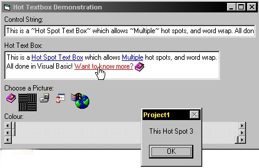



## Hot Link\! Control

### Description

This control emulates hot links (seen in web pages, and other apps like Outlook mail rules and the triggers section of the Starcraft Level editor.) It supports word wrap, pictures and highlighting! Have a look and please vote!
 
### More Info
 

             |
---                |---
**Submitted On**   |2000-11-19 15:29:40
**By**             |[Michael Pot&\#232;](https://github.com/Planet-Source-Code/PSCIndex/blob/master/ByAuthor/michael-pot-232.md)
**Level**          |Advanced
**User Rating**    |4.6 (41 globes from 9 users)
**Compatibility**  |VB 4\.0 \(32\-bit\), VB 5\.0, VB 6\.0
**Category**       |[Custom Controls/ Forms/  Menus](https://github.com/Planet-Source-Code/PSCIndex/blob/master/ByCategory/custom-controls-forms-menus__1-4.md)
**World**          |[Visual Basic](https://github.com/Planet-Source-Code/PSCIndex/blob/master/ByWorld/visual-basic.md)
**Archive File**   |[CODE\_UPLOAD1183211192000\.zip](https://github.com/Planet-Source-Code/michael-pot-232-hot-link-control__1-12936/archive/master.zip)

